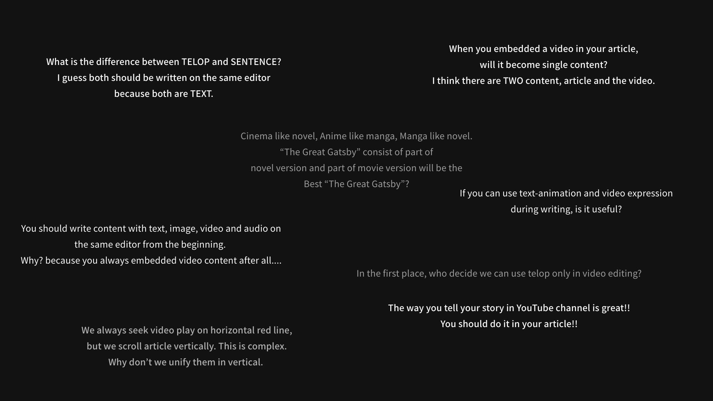
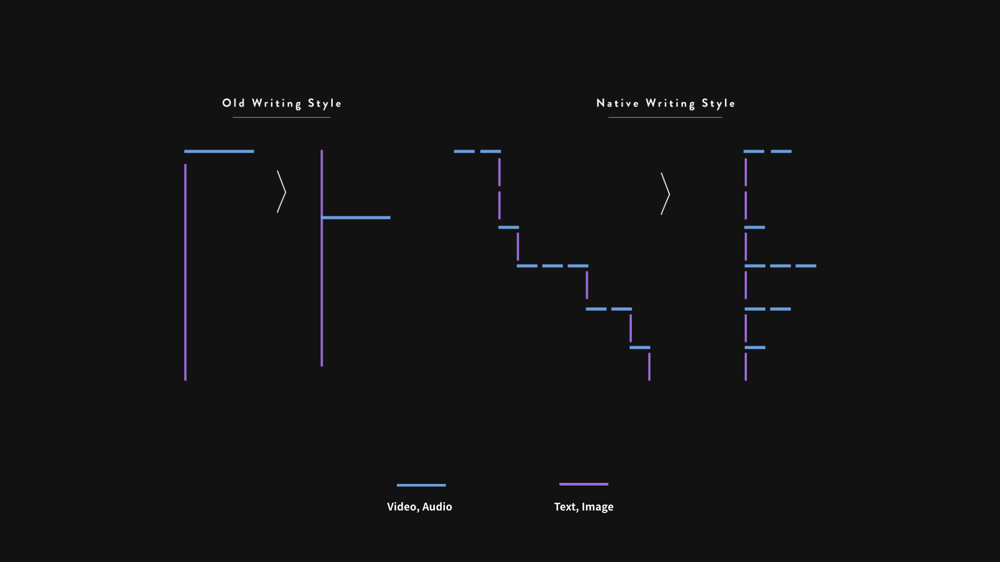
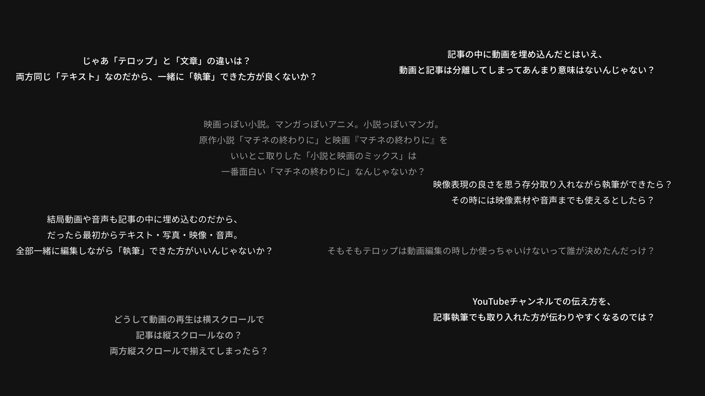

I summarized the problems people have in contents industies below, but actually I don’t understand what Naive is, and what will be changed by Native. 

“How the world will be better by Native”. This is a big issue and we can’t identify the answer without pragmatic actions from now on. The following summary is just for reference purposes.

## My lots of questions

;

in the image above, there are my questions in terms of current digital contents industies. These are not particular message, but I guess I can share my original perspective with you.

## Invonvenience in writing

### “Why YouTuber can’t write article with video expression?”

This s a story symbolize how current writing style OLD.

Today, there are a lot of YouTuber in the world, and they also have chance to write something. And when we read them, we realize immediately that all of them are consist of TEXT and IMAGE, and there is no animation and video expression.

I suppose most of YouTuber has great ability to tell something through video expression, so I guess they should write article with it. This is nonsense.

### “You can’t tell your story how you want to tell”.

;

I think current writing style is just OLD.  The left side in image above, this is a figure represent current writing process. At first, you write article in text editor, and edit video in video editor, then finally you embedded the edited video in the article. By doing this, you think “OK, I could create article with video!”. But… is it enough?

Please think. What is the difference between TELOP in video and SENTENCE in article?

What I want to say is that, as the right side of image,  “if you need video in your content, you should write content and edit video and add telop in one process on the same editor”. 

“Video content creation” is a process which cram everything in a 1920px * 1080px square. I don’t think it always can be the best way.

## High cost

Today, we live in “Video Era”. Many Web media has official YouTube cnannel and TikTok account, and plan a lot of contents and create them every platform. This flow seems to be natural, but if I had to say, “Is it really true that all web media have to create different content for each platform besides contents in web media?”.

For example, If they can create content for web media with video, there will be the case that they don’t need to create content for each platform. Of course using platform is beneficial to increate user flow, so for example, they can clip a part of content based on linear-native and upload it to platform. I guess it’s really hard and costly to create content for each platform and Native will solve it.

---

以下、コンテンツ産業において人々が抱えている課題を簡潔に整理していますが、現時点で、私自身Nativeがどのようなものか理解ができていないし、これによって生まれる新たな「当たり前」がどのようなものなのかも計り知ることは困難である。
「Nativeがどのように社会を良くするか」は実際に手を動かしていく過程で明らかになっていくものであるため、以下は参考までに留めていただきたい。

## 私が思う疑問

;

上記は私が今のコンテンツ産業において不思議に感じる点について並べたものである。これらは何かを明確に指し示すものではないが、私がどのような視角でNativeを構想したのかを感覚的に共有することができると思う。

## 体験の不都合

### 「そもそもYouTuberがどうしてテキストと画像だけで記事を書かなきゃいけないのかわからない」

これは現代の「執筆」の古めかしさを象徴する話である。
「YouTuber」という職業が生まれて久しいが、動画の撮影・編集を生業としている彼らにも、筆を取る機会はある。そして、彼らの書いたブログ記事などに目を通すと、そに映像表現が少しもないことに気付く。
映像で伝えることが得意な彼らも、記事を書こうとするとテキストと画像しか使えないとは、一体どういうことなのだろうか。

### 「伝えたいことを、伝えたいように伝えられる状態に至っていない」

;

現代の執筆体験はとにかく「古い」。図の左は、現代の執筆スタイルを表したものである。これが示すところは、なぜ「動画ファイルを動画編集ソフト上で編集し切って、それを最後に記事の中へひとつ埋め込む」ことで「記事の中で動画が使えた」という気になれるのだろうか、ということだ。果たして動画編集における「テロップ」と、記事の「文章」、この両者を書いている時間に違いはあるのだろうか。
私が言いたいことは、「最後に動画を記事に設置するなら、最初から動画編集と記事の執筆を同じエディター上で行った方が、伝えたいことをベストな形にできるはずだろう」ということだ。（図右）「動画コンテンツ」を単体で成立させるということは、すべての情報を1920px * 1080pxの四角形の中に詰め込むことで、それが常に賢いとは思えない。

## コストがかさむ

「動画の時代」と言われる今、現在のWebメディアは自身のYouTubeチャンネルやTikTokチャンネルを設け、ここへ「そのチャンネル用のコンテンツ」をWebメディアとは別に企画・制作している。
これは当然の流れとも言えるが、あえて指摘するなら「本当にすべてのWebメディアが、各プラットフォームのチャンネルを律儀に運営していく必要があるのか」という疑義が浮かぶ。

例えば、Nativeを用いてWebメディアの記事において動画や音声を扱えるようになったら、YouTubeチャンネルやTikTokのアカウントを持つ必要がなくなるケースも多くありそうだ。少なくとも、各プラットフォームからWebメディアへの流入を促すために、広告的にコンテンツの一部をチャンネルに公開していくことは今後も続くだろうが、わざわざWebメディアとは別にコンテンツを企画・撮影・編集するのはなかなかのコストで、ここは改善できそうだ。