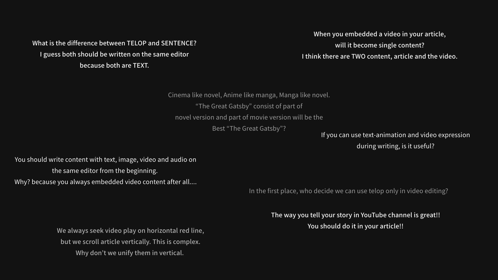

Now, we’re trying to form a company named “Odds” with engineers.

## To investor

Native is our first product, and the next step is to verify Native’s needs and identify the growth potential of this business. In order to this step, we need to develop Native for verification and update the interface design and function of Native trial and error with many creators and media companies, so we need fund to form company and start these tasks.

Based on Native itself and my career so far and documents on this site, if you feel the potential of Native and our future and sympathy for our mission “contribute to society though fantastic products”, please contact us.

## To engineer

In terms of my skill-set, I can write HTML/CSS(Sass) and I’ve built site-theme for WordPress/Gatsby JS/Shopify. I use MacOS & Visual Studio Code, and I spent 6 months on developing Native from scratch(actually my JavaScript skill was also scratch…).

I don’t have enough skill in tech and communication,  but I know that what I want to do in my life is creating product and contribute to people and this is unchangeable. As I research and design Native and develop it by myself, I will learn everything  to create fantastic product from now on, I promise.

Whether it will be large or small, Native will change something and make it better and now I need a team member create many product now. In order to this purpose, I’m calling on you with unreliable english. Even if you can’t believe my words, this will be a good chance for you to meet people who has same values and same purpose from all over the world.

If you’re interested in, please contact us!  

### Contact

Twitter DM: @inc_odds E-mail: odds@shun-muraki.jp I definitely reply all message in 24 hours.

---

## 投資家の方へ

現在、僕はこれから集うエンジニアたちと「Odds」という会社を設立しようと考えています。

「Native」はOddsの最初のプロダクトで、このプロダクトのニーズを具体的に検証し、事業成長の可能性を明らかにすることが次のステップです。そのためには今の僕が開発したクオリティの低いNativeを作り込みながら、多くのクリエイターや企業に協力を得ながら検証をしていける状態に持っていく必要があります。

そのためには会社を組織するための資金が必要で、これを投資して下さるエンジェル投資家の方を必要としています。

Naive本体や僕のこれまでの経歴、本サイトの資料などを踏まえ、Nativeと僕の未来に可能性を感じ、、またOddsの「ファンタスティックなプロダクトで社会に貢献する」というプロダクト第一のバリューに共感して頂けたら、ぜひ一度ご連絡をいただきたいです。よろしくお願いします。

## エンジニアの方へ

私のスキルセットについてですが、HTML・CSS（Sass）が書けて、WordPressとGatsby JS、Shopify で独自テーマを開発した経験があります。MacOSでVSCodeメインの開発をしており、Neovimを最近使い始めました。今公開しているNativeは自分で半年間かけて開発しました。ライブラリはほとんど使っておらず、開発当初はほとんどJavaScriptが書けませんでした。

僕には技術的な側面でも語学の面でも、足りないことが多く目立ちます。しかし「僕自身のキャリアプラン」にも記述しているように、僕にとって最も情熱を感じることは「ものづくり」で、これはブレません。プロダクトを通じて世界中の人に貢献するためにNativeを構想し、Nativeを本格的に開発するために現在のロークオリティなNativeを自身で開発したように、僕はこれからも、プロダクトで人に貢献するために必要なすべてのことを躊躇せずに学び、経験から吸収していくことを約束します。

Nativeはその大小によらず、世界のどこかを良くできると信じていますが、僕はこのNativeにとどまらず、ともに優れたプロダクトを作っていけるようなチームを求めています。そのために、頼り甲斐のない僕が旗を振って、辿々しい英語で世界に対してこのような呼びかけをしています。今、僕の言葉が信じられなくても、これはきっとプロダクトづくりに情熱を感じる世界各地の人々とタッグを組めるチャンスになるはずです。

NativeやOddsのこれからに興味を持っていただけましたら、ぜひ気軽にご連絡をください！よろしくお願いします。

### 連絡先

Twitter DM: @inc_odds E-Mail: odds@shun-muraki.jp 必ず24時間以内に返信をします。

